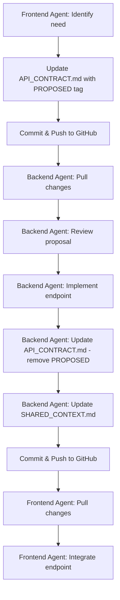

# Agent Collaboration Workflow

> **For**: AI Agents working on Gemini Command Deck
> **Last Updated**: 2026-02-03

---

## 🤖 Agent Roles

| Agent | Location | Responsibilities |
|-------|----------|------------------|
| **Frontend Agent** | Orchids IDE (Windows) | UI, React, Next.js, Styling |
| **Backend Agent** | Server | FastAPI, Python, Database, AI Logic |

---

## 📋 Collaboration Rules

### Rule 1: Document First
```
Before implementing → Update documentation
After implementing → Verify documentation matches code
```

### Rule 2: API Contract is Law
```
- Frontend implements TO the contract
- Backend implements FOR the contract
- Changes require contract update FIRST
```

### Rule 3: Git is the Sync Point
```
GitHub = Source of Truth
Both agents pull/push to same repo
```

---

## 🔄 Standard Workflows

### Workflow A: Frontend Needs New Endpoint



**Steps**:
1. **Frontend Agent**: Add to `API_CONTRACT.md`:
   ```markdown
   ### [PROPOSED] New Endpoint Name
   - Method: POST/GET
   - Path: /api/...
   - Request: { ... }
   - Response: { ... }
   - Reason: Why this is needed
   ```
2. Commit & push
3. **Backend Agent**: Pulls, reviews, implements
4. **Backend Agent**: Removes `[PROPOSED]`, updates docs
5. **Frontend Agent**: Pulls, integrates

---

### Workflow B: Backend Changes Existing Endpoint

```
1. Backend Agent: Update API_CONTRACT.md with [BREAKING] if needed
2. Backend Agent: Update CHANGELOG.md
3. Backend Agent: Update SHARED_CONTEXT.md (Inter-Agent Messages)
4. Commit & Push
5. Frontend Agent: Pull, read messages, adapt code
```

---

### Workflow C: Bug Report

```
1. Either Agent: Add to SHARED_CONTEXT.md → Known Issues
2. Commit & Push
3. Responsible Agent: Fix bug
4. Responsible Agent: Move issue to "Fixed in [version]"
5. Commit & Push
```

---

## 📁 Documentation Files

| File | Purpose | Who Updates |
|------|---------|-------------|
| `docs/API_CONTRACT.md` | API specification | Both |
| `docs/SHARED_CONTEXT.md` | Shared memory, status, messages | Both |
| `CHANGELOG.md` | Version history | Both |
| `README.md` | Project overview | Both |
| `.env.example` | Environment template | Both |

---

## 🔔 Notification System

Since agents can't directly message each other, use the **Inter-Agent Messages** section in `SHARED_CONTEXT.md`:

```markdown
### From Frontend Agent → Backend Agent
```
[DATE] Message here
```

### From Backend Agent → Frontend Agent
```
[DATE] Message here
```
```

**Check this section on every `git pull`!**

---

## ✅ Pre-Push Checklist

### Frontend Agent
- [ ] Code compiles (`npm run build`)
- [ ] No lint errors (`npm run lint`)
- [ ] API_CONTRACT.md reflects any new API usage
- [ ] CHANGELOG.md updated
- [ ] SHARED_CONTEXT.md status updated

### Backend Agent
- [ ] Tests pass
- [ ] API matches API_CONTRACT.md
- [ ] CHANGELOG.md updated
- [ ] SHARED_CONTEXT.md status updated
- [ ] Left message for Frontend if needed

---

## 🚨 Conflict Resolution

If both agents modify the same file:

1. **Git will show conflict markers**
2. **Rule**: More recent change wins, unless it breaks the other agent's work
3. **Always**: Communicate via SHARED_CONTEXT.md after resolving

---

## 📊 Status Codes for SHARED_CONTEXT.md

| Code | Meaning |
|------|---------|
| ✅ Complete | Fully implemented and tested |
| ⏳ In Progress | Currently being worked on |
| 🔜 TODO | Planned but not started |
| ❌ Blocked | Waiting on something |
| ⚠️ Needs Review | Done but needs other agent to check |

---

## 🎯 Quick Reference

```bash
# Frontend Agent (Orchids) - Start of Session
git pull github master
# Check docs/SHARED_CONTEXT.md for messages from Backend

# Frontend Agent (Orchids) - End of Session
git add .
git commit -m "type: description"
git push github master

# Backend Agent (Server) - Same pattern
git pull origin master
# Check docs/SHARED_CONTEXT.md for messages from Frontend
# ... work ...
git add . && git commit -m "type: description" && git push origin master
```
